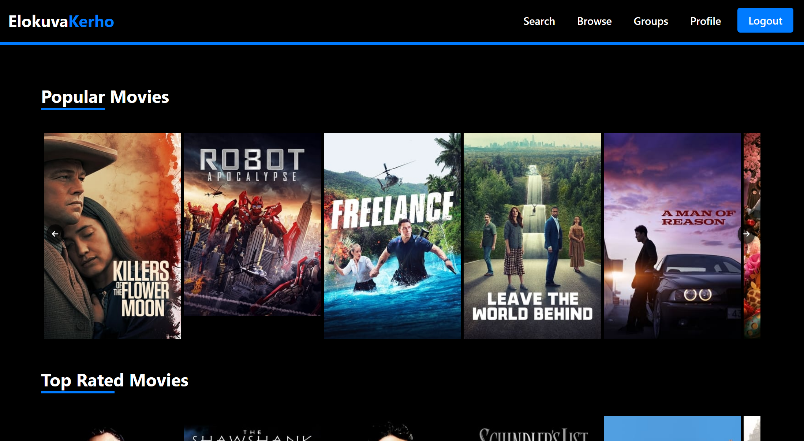
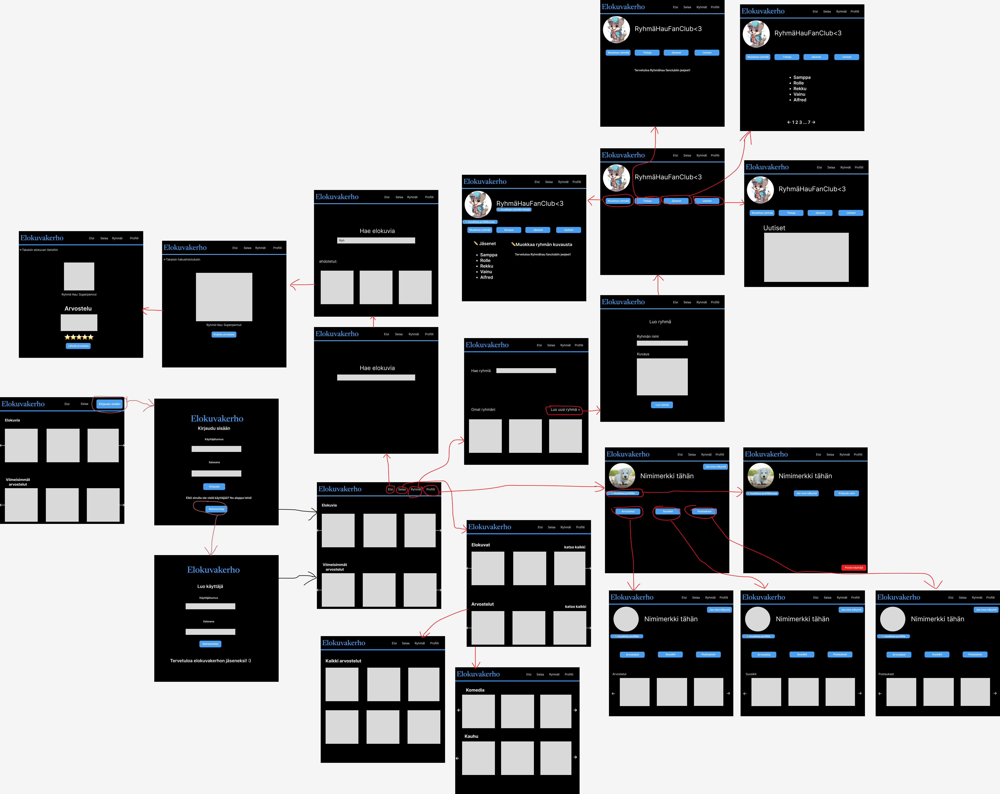
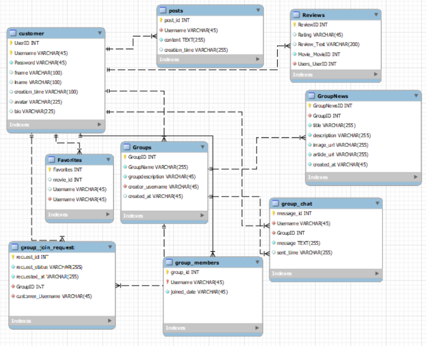

# ELOKUVAKERHO-WEBSOVELLUS

## Johdanto

Elokuvakerho on Oulun Ammattikorkeakoulun tieto- ja viestintätekniikan 2. vuoden opiskelijoiden toteuttama websovellusprojekti. Se on laaja elokuvien ja sarjojen tietopankki, joka on suunniteltu sekä elokuvaharrastajille että satunnaiskatsojille. Sovelluksessa voi luoda oman käyttäjäprofiilin, jonka kautta on mahdollista arvostella elokuvia sekä osallistua keskusteluihin muiden käyttäjien kanssa ryhmissä.

## Miten sovellus toimii?

Elokuvakerho-sovelluksessa voi selata erilaisia elokuvia ja sarjoja sekä lukea muiden käyttäjien arvosteluita ilman rekisteröitymistä. Mikäli haluaa hyödyntää kaikki sovelluksen ominaisuudet, voi sovellukseen rekisteröityä ja luoda oman käyttäjäprofiilin. Rekisteröitynyt käyttäjä voi lisätä elokuvia suosikkeihin ja kirjoittaa omia arvosteluja. Kaikki omat suosikit ja arvostelut tallentuvat profiiliin, josta ne ovat helposti uudelleen löydettävissä. Sovelluksessa on mahdollista myös perustaa uusia ryhmiä sekä lähettää liittymispyyntöjä jo olemassa oleviin ryhmiin. Ryhmissä jäsenet voivat jakaa keskenään kiinnostavia uutisia ja käydä keskusteluja.

## Sovelluksen etusivu:

#### 

## Alkuperäinen UI-suunnitelma

Alla (kuva 2) ryhmän alkuperäinen käyttöliittymäsuunnitelma. Sivun ulkoasua on muutettu alkuperäisestä suunnitelmasta, mutta sivujen navigointi on pysynyt lähes samanlaisena. Olemme kuitenkin lisänneet muutamia lisätoimintoja ja lisäsivuja, joita tässä suunnitelmassa ei ole näkyvillä.  

#### Navigointi sovelluksessa: 

Sovelluksen etusivulla käyttäjä voi selata suosittuja-, parhaiten arvosteltuja- ja tulossa olevia elokuvia. Yläpalkista käsin voi navigoida ”Kirjaudu sisään” -osioon ja sieltä jatkaa ”Rekisteröidy uutena käyttäjänä” -osioon jos omaa käyttäjää ei vielä ole. Lisäksi yläpalkista voi hakea ja selata elokuvia ja tv-sarjoja. Sieltä pääsee myös tarkastelemaan tilastoja sekä lukemaan käyttäjien arvosteluita ja uutisia.  

Omaan profiiliin pääsee siirtymään yläpalkin ”Profile” kohdasta. Profiilista pääsee ”Muokkaa profiilia” -sivulle, jossa voi esimerkiksi vaihtaa profiilikuvaketta ja biotekstiä tai poistaa koko käyttäjätilin. ”Ryhmät”-sivulle pääsee yläpalkin ”Groups” kohdasta, josta pääsee ryhmien sivuille sekä luomaan myös uuden ryhmän.  

## Sovelluksen ER-Kaavio

## Millä teknologioilla tehty?

Projektimme on rakennettu React-sovelluksena, jota kehitämme Visual Studio Coden avulla. Palvelinpuolen olemme toteuttaneet Node.js-alustalla ja tietokantana käytämme PostgreSQL:ää, jonka loimme Renderin kautta.

Käyttämämme koodikielet ovat JavaScript, HTML ja CSS. Sovelluksen käyttöliittymän suunnitteluun olemme käyttäneet Figmaa ja tietokannan ER-kaavion luontiin MySQL Workbenchiä.

## Ketkä tekivät?

Ryhmämme jäsenet ovat Roope Nahkala, Tomi Pihlajamaa, Valtteri Vimpari, Julius Pohjanen ja Noora Ylitalo.

## Vastuualueemme: 

Roope Nahkala: Fullstack/mm. TMDB API, Elokuvien ja näyttelijöiden sivut. Suodatettu haku. 

Tomi Pihlajamaa: Fullstack/mm. Finnkino XML, API-dokumentaatio 

Valtteri Vimpari: Frontend/mm. Oman näkymän jakaminen  

Julius Pohjanen: Fullstack/mm. Arvostelut, backend testit 

Noora Ylitalo: Fullstack / mm. Käyttäjätilin poisto, ryhmänjäsenten poistaminen/omistajuuden siirto 

## Esittelyvideo

[Linkki esittelyvideoon](https://youtu.be/w75aTxZCO9o?si=xgC3pi3o-LhbaYj2)

## Linkki sovellukseen

[Elokuvakerho Websovellus](https://elokuvakerho.onrender.com/)

## API dokumentti

[API documentation](https://documenter.getpostman.com/view/27009159/2s9YkjANet)
